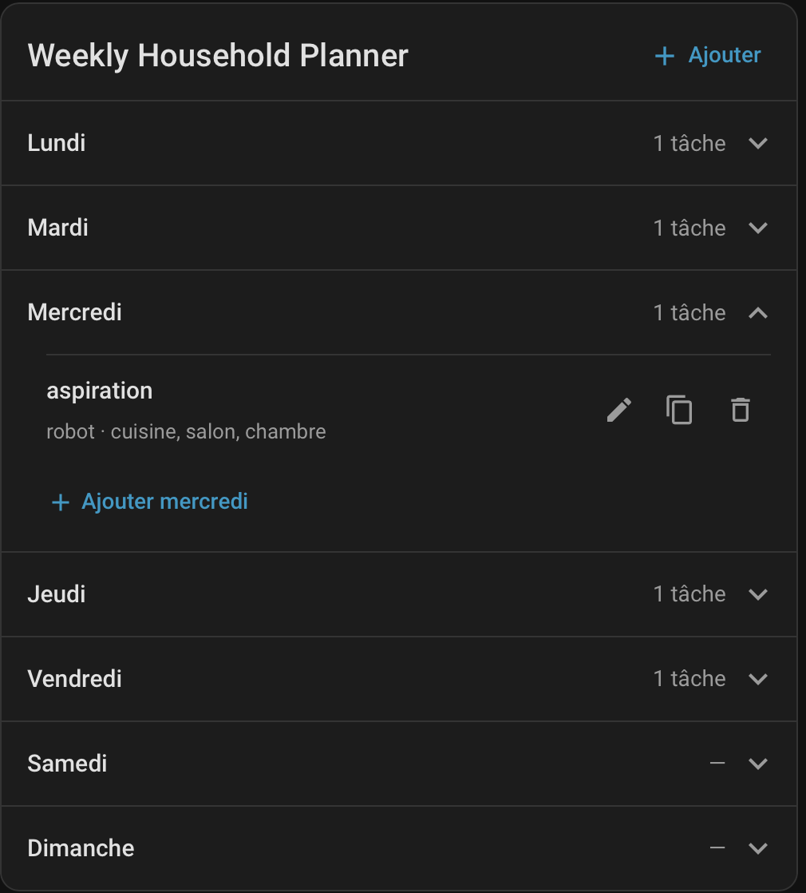

# Weekly Household Planner

Weekly Household Planner is a custom integration for Home Assistant that provides a simple and flexible way to organize recurring household tasks throughout the week.

The planner is generic: tasks can be performed by people, robots, or any other actor you define.

## Preview


## Features

- 📅 Weekly household task planning
- 👤 Configurable actors
- 🎨 Configurable color for each actor
- 🧹 Configurable task types
- ⚙️ Custom task parameters
- 🗓 Native Home Assistant calendar
- 🏠 Lovelace weekly planner card
- ➕ Add tasks to one or multiple days
- ✏️ Edit scheduled tasks
- 📋 Duplicate tasks to other days
- 🗑 Delete scheduled tasks
- 🔧 Home Assistant actions/services for accessing and modifying the planner
- 📆 Today Card for displaying the current day's tasks
- ✅ Mark daily tasks as completed or incomplete
- 💾 Persistent task completion status
- 🔄 Real-time task completion synchronization
- 📅 Automatic daily completion reset

## Example

A planner can contain actors such as:

- `robot`
- `manual`

Tasks can then be defined independently.

For example:

**Aspiration**
- Actor: `robot`
- Parameter: `room`
- Rooms: `kitchen`, `living_room`

**Cleaning**
- Actor: `manual`
- Parameter: `room`

The integration does not impose specific household tasks or devices. Actors, tasks and parameters are configured from Home Assistant.

## Installation

### HACS

1. Open HACS in Home Assistant.
2. Go to **Integrations**.
3. Open the menu and select **Custom repositories**.
4. Add:

   `https://github.com/yoann74540/weekly_household_planner`

5. Select **Integration** as the repository type.
6. Install **Weekly Household Planner**.
7. Restart Home Assistant.

### Manual installation

Copy:

`custom_components/weekly_household_planner`

into your Home Assistant configuration directory:

`config/custom_components/weekly_household_planner`

Restart Home Assistant.

## Configuration

After installation:

**Settings → Devices & services → Add integration → Weekly Household Planner**

The configuration is divided into several steps.

### Actors

Actors represent who or what can perform a task.

Examples:

- `robot`
- `manual`
- `alice`
- `bob`

After defining the actors, a color can be assigned to each one using Home Assistant's color selector.

Actor colors are used in the weekly planner card to visually distinguish tasks assigned to different actors.

### Parameters

Parameters describe additional information associated with tasks.

For example, a `room` parameter could contain:

- `kitchen`
- `living_room`
- `bathroom`
- `bedroom`

### Tasks

Tasks define the activities available in the planner.

Each task can specify:

- which actors can perform it;
- which parameters it uses;
- whether each parameter is required;
- whether a parameter accepts one or multiple values.

For example:

```text
Task: vacuum
Actor: robot
Parameter: room
Type: multiple selection
Required: yes
```

## Weekly planner card

The integration includes a Lovelace card for managing the weekly schedule directly from the Home Assistant dashboard.

Tasks are displayed as color-coded tiles using the color configured for each actor, making it easy to identify who or what is responsible for a task.

It allows you to:

- view tasks grouped by weekday;
- visually identify tasks by actor color;
- add a task;
- add the same task to multiple days;
- edit a task;
- duplicate a task to other days;
- delete a task.

## Today Card

Weekly Household Planner also provides a compact, interactive Lovelace card designed to display only the tasks scheduled for the current day.

It is especially useful for wall-mounted dashboards and small displays such as the NSPanel Pro.

The Today Card provides:

- 📅 Automatic display of the current day's tasks.
- 🎨 Color-coded task tiles based on the assigned actor.
- 📱 A compact two-column layout optimized for small screens.
- 👆 Short tap on a task to open a popup showing its details and parameters.
- ✅ Long press (700 ms) anywhere on a task to mark it as completed or incomplete.
- 🛡️ Long press prevents accidental task completion on touchscreens.
- 👤 Task completion is available for all actors, including people and robots.
- 💾 Completion status is saved and restored after a page reload or Home Assistant restart.
- 🔄 Real-time synchronization of completion status across dashboards.
- 📅 Completion status is tracked separately for each day.
- 🔒 Task scheduling and definitions cannot be modified from this card.

A gray outlined circle indicates an incomplete task. A green circle with a checkmark indicates a completed task.

The Today Card uses the same planner configuration and schedule as the Weekly Planner Card, ensuring that both cards display consistent information.


## Calendar

Weekly Household Planner also creates a native Home Assistant calendar entity.

Scheduled tasks can therefore be viewed using Home Assistant's standard calendar interface.

## Home Assistant actions

The integration exposes the following actions:

- `weekly_household_planner.get_definition`
- `weekly_household_planner.get_schedule`
- `weekly_household_planner.get_tasks`
- `weekly_household_planner.add_task`
- `weekly_household_planner.update_task`
- `weekly_household_planner.remove_task`
- `weekly_household_planner.get_completions`
- `weekly_household_planner.complete_task`

This makes it possible to use the planner from automations and other Home Assistant integrations.

### Example

```yaml
action: weekly_household_planner.add_task
data:
  day: monday
  who: robot
  task: vacuum
  parameters:
    room:
      - kitchen
      - living_room
```

## Using tasks in automations

Weekly Household Planner is intentionally device-independent.

It manages **what should be done and when**, while Home Assistant automations and scripts decide **how the task should be executed**.

The `get_tasks` action can be used to retrieve scheduled tasks using optional filters such as the day, actor, or task type.

For example, retrieve all tasks assigned to `robot` for the current day:

```yaml
- action: weekly_household_planner.get_tasks
  data:
    day: today
    who: robot
  response_variable: planner
```

The response contains the matching tasks:

```yaml
tasks:
  - id: "..."
    day: monday
    who: robot
    task: vacuum
    parameters:
      room:
        - kitchen
        - living_room
```

The returned tasks can then be used in an automation:

```yaml
- action: weekly_household_planner.get_tasks
  data:
    day: today
    who: robot
  response_variable: planner

- repeat:
    for_each: "{{ planner.tasks }}"
    sequence:
      - action: script.execute_household_task
        data:
          task: "{{ repeat.item.task }}"
          parameters: "{{ repeat.item.parameters }}"
```

The script or automation is responsible for translating the generic task into device-specific actions.

This keeps Weekly Household Planner independent from specific devices and integrations while allowing it to control real-world workflows through Home Assistant automations.

### Task completion

The `complete_task` action allows Home Assistant automations and scripts to mark a scheduled task as completed or incomplete.

Example:

```yaml
action: weekly_household_planner.complete_task
data:
  task_id: "your-task-id"
  completed: true
```

Set `completed` to `false` to mark the task as incomplete.

The `get_completions` action retrieves the completion status of tasks scheduled for the current day.

Completion changes are also broadcast through the `weekly_household_planner_task_completion_changed` event, allowing dashboards and automations to react to updates.

Completion records are automatically cleaned up outside the current calendar week.


## How it works

Weekly Household Planner manages the **planning and organization** of tasks.

It intentionally does not execute household tasks or control devices directly.

For example, adding a `vacuum` task for a robot records the task in the weekly schedule but does not directly start a vacuum cleaner.

Home Assistant automations and scripts can retrieve scheduled tasks using `get_tasks` and translate them into actions for specific devices or integrations.

## Updating the planner configuration

The integration can be reconfigured from:

**Settings → Devices & services → Weekly Household Planner → Configure**

Actors, actor colors, parameters and task definitions can be modified after installation.

The planner automatically reconciles scheduled tasks when their definition changes.

## Requirements

- Home Assistant
- HACS (optional, recommended for installation and updates)

## Development status

Weekly Household Planner is currently under active development.

The configuration format and available features may evolve in future releases.

## Issues

Bug reports and feature requests can be submitted through the GitHub issue tracker:

`https://github.com/yoann74540/weekly_household_planner/issues`

## License

MIT License